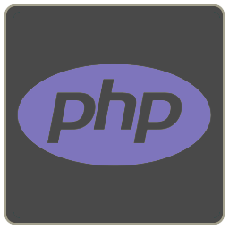

# Joseph Stameus

## aka oxifinch 🛰️
**Connect with me:**
[LinkedIn](https://www.linkedin.com/in/josephstameus/)

**Project showcase**
- [**Budget Helper**: Full-stack web app written in Go](https://github.com/oxifinch/budget-helper)
- [**Skalver**: Node.js/Express app for writing notebooks in Markdown, using MongoDB](https://github.com/oxifinch/skalver)
- [**skalver-mdparser**: Markdown parser & HTML compiler for Skalver, ported to WebAssembly](https://github.com/oxifinch/skalver-mdparser)

**Languages and technologies:**

## Current status: LOOKING FOR WORK
**Back-end Web Developer** looking for work in Malmö, Copenhagen or remotely, preferrably full-time. See my [LinkedIn profile](https://www.linkedin.com/in/josephstameus/) for more details and qualifications.  
I'm looking to work as a:
  - Back-end Web Developer in general
  - PHP developer
  - JavaScript/Node developer
  - Go/C#/Java developer

## About me
Hello there! I'm a web developer and graduate from Glimåkra Folkhögskola in Sweden. I'm happiest when working on the back end with server-side applications, databases and technical problem solving, all the "dry" stuff that involves moving pieces of data around, and I feel most at home in a dark and cozy terminal on Linux. 

Before taking up programming, I worked with game development as a 3D graphics generalist, and took an interest in learning how to code after working close with some programmers on an indie game project.

In my free time, I'm either programming some more, writing sci-fi/fantasy novels about cowboy wizards and spaceships, playing tabletop RPGs as a Game Master, or taking long hikes out in the woods. 

### I'm currently learning
- Go
- HTMX
- SQL/SQLite

### What I'm working on
- [My exam project, budget-helper](https://github.com/oxifinch/budget-helper)
- My portfolio(this one right here!)

### My favorite tools
- Bash
- Vim
- ..pretty much anything that has to do with Linux, actually.
- Obsidian

[linkedin]: https://www.linkedin.com/in/josephstameus/
